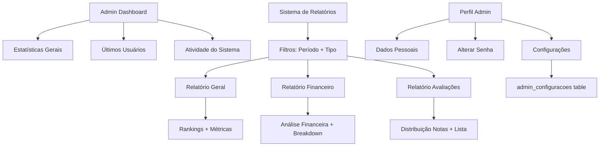

# Design Document

## Overview

Este documento descreve o design técnico para finalizar a área administrativa do sistema de agendamento de serviços de saúde domiciliar. A solução envolve refatoração do dashboard administrativo para remover funcionalidades de solicitações individuais e implementação completa de um sistema de relatórios gerenciais com três tipos de análises (Geral, Financeiro e Avaliações), além de uma página de perfil do administrador com configurações personalizáveis.

## Architecture

### Estrutura de Arquivos

```
admin/
├── index.php              # Dashboard principal (refatorado)
├── usuarios.php           # Gerenciamento de usuários (existente)
├── servicos.php           # Gerenciamento de serviços (existente)
├── relatorios.php         # Sistema de relatórios (novo)
├── perfil.php             # Perfil do administrador (novo)
└── solicitacoes.php       # Removido do menu (arquivo pode permanecer)

database/
└── script_inicial.sql     # Atualizado com tabela admin_configuracoes

assets/css/
└── style.css              # Estilos adicionados para relatórios e perfil
```

### Fluxo de Dados



## Components and Interfaces

### 1. Dashboard Administrativo (admin/index.php)

**Responsabilidades:**
- Exibir 6 cards de estatísticas gerais
- Mostrar tabela de últimos 5 usuários cadastrados
- Exibir card de atividade do sistema (últimos 30 dias)
- Remover menu "Solicitações" da sidebar
- Remover tabela de últimas solicitações

**Queries SQL Principais:**

```sql
-- Estatísticas básicas (mantidas)
SELECT COUNT(*) as total FROM usuarios
SELECT COUNT(*) as total FROM usuarios WHERE tipo_usuario = 'prestador'
SELECT COUNT(*) as total FROM usuarios WHERE tipo_usuario = 'cliente'
SELECT COUNT(*) as total FROM servicos WHERE status = 'ativo'
SELECT COUNT(*) as total FROM solicitacoes
SELECT COUNT(*) as total FROM solicitacoes WHERE status = 'pendente'
SELECT COUNT(*) as total FROM solicitacoes WHERE status = 'concluida'

-- Estatísticas de atividade (novas)
SELECT 
    (SELECT COUNT(*) FROM usuarios WHERE created_at >= DATE_SUB(NOW(), INTERVAL 30 DAY)) as novos_usuarios_mes,
    (SELECT COUNT(*) FROM solicitacoes WHERE status = 'concluida' AND data_conclusao >= DATE_SUB(NOW(), INTERVAL 30 DAY)) as atendimentos_mes,
    (SELECT AVG(nota) FROM avaliacoes WHERE data_avaliacao >= DATE_SUB(NOW(), INTERVAL 30 DAY)) as media_geral,
    (SELECT SUM(valor_total) FROM solicitacoes WHERE status = 'concluida' AND data_conclusao >= DATE_SUB(NOW(), INTERVAL 30 DAY)) as volume_mes
```

**Interface HTML:**
- Sidebar sem link "Solicitações"
- Grid de 6 cards de estatísticas
- Tabela de últimos usuários (mantida)
- Card de atividade do sistema com 4 métricas

### 2. Sistema de Relatórios (admin/relatorios.php)

**Responsabilidades:**
- Filtrar relatórios por período (7, 30, 90, 365 dias)
- Alternar entre 3 tipos de relatórios
- Gerar análises baseadas em queries SQL complexas
- Permitir impressão dos relatórios

**Parâmetros de URL:**
- `periodo`: 7, 30, 90 ou 365 (padrão: 30)
- `tipo`: geral, financeiro ou avaliacoes (padrão: geral)

#### 2.1 Relatório Geral

**Queries SQL:**

```sql
-- Métricas gerais
SELECT 
    COUNT(DISTINCT u.id) as total_usuarios,
    COUNT(DISTINCT CASE WHEN u.tipo_usuario = 'cliente' THEN u.id END) as total_clientes,
    COUNT(DISTINCT CASE WHEN u.tipo_usuario = 'prestador' THEN u.id END) as total_prestadores,
    COUNT(DISTINCT CASE WHEN u.created_at >= ? THEN u.id END) as novos_usuarios,
    COUNT(DISTINCT s.id) as total_solicitacoes,
    COUNT(DISTINCT CASE WHEN s.status = 'concluida' THEN s.id END) as solicitacoes_concluidas,
    COUNT(DISTINCT CASE WHEN s.data_solicitacao >= ? THEN s.id END) as solicitacoes_periodo,
    COALESCE(SUM(CASE WHEN s.status = 'concluida' AND s.data_conclusao >= ? THEN s.valor_total END), 0) as volume_financeiro,
    COUNT(DISTINCT a.id) as total_avaliacoes,
    COALESCE(AVG(a.nota), 0) as media_avaliacoes
FROM usuarios u
LEFT JOIN solicitacoes s ON (u.id = s.cliente_id OR u.id = s.prestador_id)
LEFT JOIN avaliacoes a ON s.id = a.solicitacao_id AND a.data_avaliacao >= ?

-- Top 10 Prestadores
SELECT u.nome, u.email, 
       COUNT(s.id) as total_atendimentos,
       COALESCE(AVG(a.nota), 0) as media_avaliacao,
       COALESCE(SUM(s.valor_total), 0) as volume_total
FROM usuarios u
INNER JOIN solicitacoes s ON u.id = s.prestador_id
LEFT JOIN avaliacoes a ON s.id = a.solicitacao_id
WHERE u.tipo_usuario = 'prestador' 
AND s.status = 'concluida'
AND s.data_conclusao >= ?
GROUP BY u.id, u.nome, u.email
ORDER BY total_atendimentos DESC, media_avaliacao DESC
LIMIT 10

-- Top 10 Clientes
SELECT u.nome, u.email,
       COUNT(s.id) as total_solicitacoes,
       COALESCE(SUM(s.valor_total), 0) as volume_total
FROM usuarios u
INNER JOIN solicitacoes s ON u.id = s.cliente_id
WHERE u.tipo_usuario = 'cliente'
AND s.data_solicitacao >= ?
GROUP BY u.id, u.nome, u.email
ORDER BY total_solicitacoes DESC, volume_total DESC
LIMIT 10
```

**Interface:**
- 6 cards de métricas gerais
- 2 colunas: Top Prestadores | Top Clientes
- Rankings numerados (1º, 2º, 3º...)

#### 2.2 Relatório Financeiro

**Queries SQL:**

```sql
-- Breakdown diário
SELECT 
    DATE(s.data_conclusao) as data,
    COUNT(s.id) as atendimentos,
    SUM(s.valor_total) as volume_dia
FROM solicitacoes s
WHERE s.status = 'concluida'
AND s.data_conclusao >= ?
AND s.data_conclusao <= ?
GROUP BY DATE(s.data_conclusao)
ORDER BY data DESC

-- Análise por serviço
SELECT srv.nome_servico,
       COUNT(s.id) as total_atendimentos,
       SUM(s.valor_total) as volume_total,
       AVG(s.valor_total) as ticket_medio
FROM solicitacoes s
INNER JOIN servicos srv ON s.servico_id = srv.id
WHERE s.status = 'concluida'
AND s.data_conclusao >= ?
GROUP BY srv.id, srv.nome_servico
ORDER BY volume_total DESC
```

**Cálculos:**
- Volume Total: SUM(volume_dia)
- Atendimentos Total: SUM(atendimentos)
- Ticket Médio: Volume Total / Atendimentos Total

**Interface:**
- Card de resumo financeiro com 3 métricas
- Tabela de breakdown diário
- Lista de serviços com volume e ticket médio

#### 2.3 Relatório de Avaliações

**Queries SQL:**

```sql
-- Distribuição de notas
SELECT 
    a.nota,
    COUNT(*) as quantidade,
    ROUND((COUNT(*) * 100.0 / (SELECT COUNT(*) FROM avaliacoes WHERE data_avaliacao >= ?)), 2) as percentual
FROM avaliacoes a
WHERE a.data_avaliacao >= ?
GROUP BY a.nota
ORDER BY a.nota DESC

-- Avaliações recentes
SELECT a.*, u_cliente.nome as cliente_nome, u_prestador.nome as prestador_nome, srv.nome_servico
FROM avaliacoes a
INNER JOIN usuarios u_cliente ON a.cliente_id = u_cliente.id
INNER JOIN usuarios u_prestador ON a.prestador_id = u_prestador.id
INNER JOIN solicitacoes s ON a.solicitacao_id = s.id
INNER JOIN servicos srv ON s.servico_id = srv.id
WHERE a.data_avaliacao >= ?
ORDER BY a.data_avaliacao DESC
LIMIT 20
```

**Interface:**
- Distribuição visual com barras de progresso
- Lista de 20 avaliações recentes
- Comentários truncados em 200 caracteres

### 3. Perfil do Administrador (admin/perfil.php)

**Responsabilidades:**
- Gerenciar dados pessoais do admin
- Alterar senha com validação
- Configurar preferências do sistema
- Exibir estatísticas rápidas
- Mostrar informações do sistema

**Formulários:**

#### 3.1 Dados Pessoais
```php
POST action=dados_pessoais
- nome (required)
- email (required, unique)
- telefone (optional, masked)
```

**Validações:**
- Nome não vazio
- Email válido e único (exceto próprio usuário)
- Atualizar sessão após salvar

#### 3.2 Alterar Senha
```php
POST action=alterar_senha
- senha_atual (required)
- nova_senha (required, min 6 chars)
- confirmar_senha (required, must match)
```

**Validações:**
- Verificar senha atual com password_verify()
- Nova senha >= 6 caracteres
- Confirmação deve ser igual
- Hash com password_hash()

#### 3.3 Configurações
```php
POST action=configuracoes
- timezone (select: America/Sao_Paulo, America/Manaus, America/Rio_Branco)
- notificacoes_email (checkbox, default: true)
- relatorios_automaticos (checkbox, default: false)
```

**Lógica:**
- INSERT se não existe configuração
- UPDATE se já existe
- Buscar configurações ao carregar página

**Queries SQL:**

```sql
-- Verificar se existe
SELECT id FROM admin_configuracoes WHERE admin_id = ?

-- Inserir
INSERT INTO admin_configuracoes (admin_id, timezone, notificacoes_email, relatorios_automaticos)
VALUES (?, ?, ?, ?)

-- Atualizar
UPDATE admin_configuracoes 
SET timezone = ?, notificacoes_email = ?, relatorios_automaticos = ?
WHERE admin_id = ?

-- Buscar
SELECT * FROM admin_configuracoes WHERE admin_id = ?

-- Estatísticas do admin
SELECT 
    (SELECT COUNT(*) FROM usuarios WHERE created_at >= DATE_SUB(NOW(), INTERVAL 30 DAY)) as usuarios_mes,
    (SELECT COUNT(*) FROM solicitacoes WHERE data_solicitacao >= DATE_SUB(NOW(), INTERVAL 30 DAY)) as solicitacoes_mes,
    (SELECT COUNT(*) FROM avaliacoes WHERE data_avaliacao >= DATE_SUB(NOW(), INTERVAL 30 DAY)) as avaliacoes_mes
```

**Interface:**
- Layout 2 colunas (dados pessoais + configurações)
- 3 cards de estatísticas rápidas
- Card de informações do sistema
- Card de ações rápidas
- JavaScript para máscara de telefone

## Data Models

### Tabela: admin_configuracoes (Nova)

```sql
CREATE TABLE admin_configuracoes (
    id INT PRIMARY KEY AUTO_INCREMENT,
    admin_id INT NOT NULL,
    timezone VARCHAR(50) DEFAULT 'America/Sao_Paulo',
    notificacoes_email BOOLEAN DEFAULT TRUE,
    relatorios_automaticos BOOLEAN DEFAULT FALSE,
    created_at TIMESTAMP DEFAULT CURRENT_TIMESTAMP,
    updated_at TIMESTAMP DEFAULT CURRENT_TIMESTAMP ON UPDATE CURRENT_TIMESTAMP,
    FOREIGN KEY (admin_id) REFERENCES usuarios(id) ON DELETE CASCADE,
    INDEX idx_admin_configuracoes_admin (admin_id)
) ENGINE=InnoDB DEFAULT CHARSET=utf8mb4 COLLATE=utf8mb4_unicode_ci;
```

**Campos:**
- `id`: Identificador único
- `admin_id`: FK para usuarios.id
- `timezone`: Fuso horário (America/Sao_Paulo, America/Manaus, America/Rio_Branco)
- `notificacoes_email`: Receber notificações por email
- `relatorios_automaticos`: Receber relatórios semanais automaticamente
- `created_at`: Data de criação
- `updated_at`: Data de última atualização

### Tabelas Existentes Utilizadas

**usuarios**: Dados do administrador  
**solicitacoes**: Dados para relatórios e estatísticas  
**avaliacoes**: Dados de avaliações para relatórios  
**servicos**: Análise financeira por tipo de serviço

## Error Handling

### Dashboard (index.php)
- Try-catch em todas as queries
- Variável `$error` para mensagens genéricas
- Não expor detalhes técnicos ao usuário

### Relatórios (relatorios.php)
- Validar parâmetros GET (periodo, tipo)
- Try-catch em queries complexas
- Exibir mensagem amigável em caso de erro
- Garantir que arrays estejam definidos antes de iterar

### Perfil (perfil.php)
- Array `$errors` para acumular erros de validação
- Variável `$success` para mensagens de sucesso
- Validar unicidade de email
- Verificar senha atual antes de alterar
- Try-catch em operações de banco

**Mensagens de Erro:**
```php
// Validação
"Nome é obrigatório"
"Email é obrigatório"
"Email inválido"
"Este email já está sendo usado por outro usuário"
"Senha atual é obrigatória"
"Nova senha deve ter pelo menos 6 caracteres"
"Confirmação de senha não confere"
"Senha atual incorreta"

// Banco de dados
"Erro ao atualizar dados pessoais"
"Erro ao alterar senha"
"Erro ao salvar configurações"
"Erro ao gerar relatórios"
```

## Testing Strategy

### Testes Manuais

#### Dashboard
1. Acessar admin/index.php
2. Verificar que menu "Solicitações" não aparece
3. Verificar 6 cards de estatísticas
4. Verificar tabela de últimos usuários
5. Verificar card de atividade do sistema
6. Confirmar que não há tabela de solicitações

#### Relatórios
1. Acessar admin/relatorios.php
2. Testar filtro de período (7, 30, 90, 365 dias)
3. Testar cada tipo de relatório:
   - Geral: verificar métricas e rankings
   - Financeiro: verificar cálculos e breakdown
   - Avaliações: verificar distribuição e lista
4. Testar impressão (Ctrl+P)
5. Verificar responsividade

#### Perfil
1. Acessar admin/perfil.php
2. Testar edição de dados pessoais
3. Testar validação de email duplicado
4. Testar alteração de senha
5. Testar validação de senha atual
6. Testar salvamento de configurações
7. Verificar máscara de telefone
8. Verificar estatísticas rápidas

### Casos de Teste SQL

```sql
-- Verificar criação da tabela
SHOW CREATE TABLE admin_configuracoes;

-- Testar inserção
INSERT INTO admin_configuracoes (admin_id, timezone, notificacoes_email, relatorios_automaticos)
VALUES (1, 'America/Sao_Paulo', 1, 0);

-- Testar atualização
UPDATE admin_configuracoes SET timezone = 'America/Manaus' WHERE admin_id = 1;

-- Testar busca
SELECT * FROM admin_configuracoes WHERE admin_id = 1;

-- Testar queries de relatórios com diferentes períodos
-- (executar queries do design com DATE_SUB variando)
```

### Validações de Interface

- [ ] Sidebar não contém link "Solicitações"
- [ ] Dashboard exibe 6 cards de estatísticas
- [ ] Card de atividade mostra 4 métricas
- [ ] Relatórios respondem a filtros
- [ ] Impressão funciona corretamente
- [ ] Formulários de perfil validam corretamente
- [ ] Máscaras de input funcionam
- [ ] Mensagens de erro/sucesso aparecem
- [ ] Layout responsivo em mobile

## Design Decisions

### 1. Remoção vs Ocultação do Menu Solicitações
**Decisão:** Remover apenas do menu, manter arquivo  
**Razão:** Permite acesso direto via URL se necessário no futuro, sem quebrar links existentes

### 2. Estrutura de Relatórios
**Decisão:** Uma única página com filtros dinâmicos  
**Razão:** Melhor UX, evita múltiplas páginas, facilita manutenção

### 3. Tabela de Configurações
**Decisão:** Criar tabela separada admin_configuracoes  
**Razão:** Separação de concerns, permite expansão futura, não polui tabela usuarios

### 4. Cálculo de Métricas
**Decisão:** Calcular em tempo real via SQL  
**Razão:** Dados sempre atualizados, não requer cache ou jobs agendados

### 5. Período Padrão de Relatórios
**Decisão:** 30 dias  
**Razão:** Balanço entre relevância e volume de dados, padrão comum em dashboards

### 6. Limite de Avaliações Recentes
**Decisão:** 20 avaliações  
**Razão:** Suficiente para análise sem sobrecarregar a página

### 7. Truncamento de Comentários
**Decisão:** 200 caracteres com "..."  
**Razão:** Mantém layout limpo, indica que há mais conteúdo

### 8. Validação de Senha
**Decisão:** Mínimo 6 caracteres  
**Razão:** Consistente com padrão já usado no sistema (auth/register.php)

### 9. Timezones Suportados
**Decisão:** Apenas 3 fusos brasileiros principais  
**Razão:** Sistema focado no Brasil, simplifica interface

### 10. Impressão de Relatórios
**Decisão:** CSS @media print  
**Razão:** Solução simples e eficaz, não requer geração de PDF
