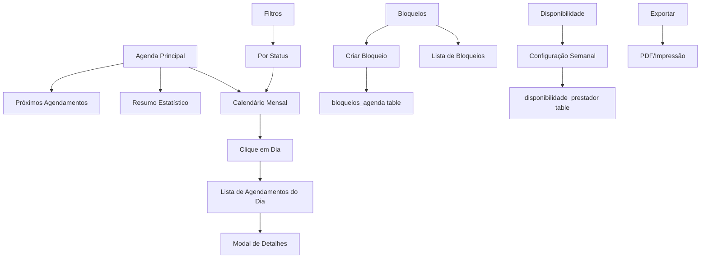

# Design Document

## Overview

Este documento descreve o design técnico para implementar um sistema completo de agenda para prestadores de serviços de saúde domiciliar. A solução inclui visualização em calendário mensal, gerenciamento de disponibilidade semanal, bloqueios de datas específicas, detalhes de agendamentos, filtros por status, informações de localização, alertas de conflito, exportação em PDF e estatísticas de produtividade.

## Architecture

### Estrutura de Arquivos

```
prestador/
├── index.php              # Dashboard (existente)
├── solicitacoes.php       # Gerenciamento de solicitações (existente)
├── agenda.php             # Sistema de agenda (novo)
├── disponibilidade.php    # Configuração de disponibilidade (novo)
├── perfil.php             # Perfil do prestador (existente)
└── servicos.php           # Serviços oferecidos (existente)

database/
└── script_inicial.sql     # Atualizado com tabelas de agenda

assets/
├── css/style.css          # Estilos para calendário e agenda
└── js/
    └── agenda.js          # JavaScript para interatividade do calendário (novo)
```

### Fluxo de Dados



## Components and Interfaces

### 1. Página Principal da Agenda (prestador/agenda.php)

**Responsabilidades:**
- Exibir calendário mensal interativo
- Mostrar resumo estatístico (3 cards)
- Listar próximos 5 agendamentos
- Permitir navegação entre meses
- Filtrar por status
- Exportar/imprimir

**Parâmetros de URL:**
- `mes`: 1-12 (padrão: mês atual)
- `ano`: YYYY (padrão: ano atual)
- `status`: pendente, aceita, em_andamento, concluida, todos (padrão: todos)

**Queries SQL Principais:**

```sql
-- Agendamentos do mês
SELECT s.*, 
       u.nome as cliente_nome, 
       u.telefone as cliente_telefone,
       srv.nome_servico,
       e.rua, e.numero, e.bairro, e.cidade, e.complemento, e.referencia
FROM solicitacoes s
INNER JOIN usuarios u ON s.cliente_id = u.id
INNER JOIN servicos srv ON s.servico_id = srv.id
INNER JOIN enderecos e ON s.endereco_id = e.id
WHERE s.prestador_id = ?
AND s.status IN ('aceita', 'em_andamento', 'concluida')
AND MONTH(s.data_inicio) = ?
AND YEAR(s.data_inicio) = ?
ORDER BY s.data_inicio, s.horario_inicio

-- Próximos agendamentos
SELECT s.*, u.nome as cliente_nome, srv.nome_servico
FROM solicitacoes s
INNER JOIN usuarios u ON s.cliente_id = u.id
INNER JOIN servicos srv ON s.servico_id = srv.id
WHERE s.prestador_id = ?
AND s.status IN ('aceita', 'em_andamento')
AND s.data_inicio >= CURDATE()
ORDER BY s.data_inicio, s.horario_inicio
LIMIT 5

-- Bloqueios do mês
SELECT * FROM bloqueios_agenda
WHERE prestador_id = ?
AND ((MONTH(data_inicio) = ? AND YEAR(data_inicio) = ?)
     OR (MONTH(data_fim) = ? AND YEAR(data_fim) = ?)
     OR (data_inicio <= ? AND data_fim >= ?))

-- Estatísticas do mês
SELECT 
    COUNT(*) as total_agendamentos,
    SUM(CASE WHEN status = 'concluida' THEN 1 ELSE 0 END) as concluidos,
    SUM(CASE WHEN data_inicio = CURDATE() THEN 1 ELSE 0 END) as hoje
FROM solicitacoes
WHERE prestador_id = ?
AND MONTH(data_inicio) = ?
AND YEAR(data_inicio) = ?
AND status IN ('aceita', 'em_andamento', 'concluida')
```

**Interface HTML:**

```html
<!-- Resumo Estatístico -->
<div class="stats-grid">
    <div class="stat-card">
        <div class="stat-value">{total_mes}</div>
        <div class="stat-label">Agendamentos do Mês</div>
    </div>
    <div class="stat-card">
        <div class="stat-value">{total_semana}</div>
        <div class="stat-label">Esta Semana</div>
    </div>
    <div class="stat-card">
        <div class="stat-value">{proximos_7_dias}</div>
        <div class="stat-label">Próximos 7 Dias</div>
    </div>
</div>

<!-- Filtros e Navegação -->
<div class="agenda-controls">
    <button onclick="mesAnterior()">← Anterior</button>
    <h3>{Mês Ano}</h3>
    <button onclick="proximoMes()">Próximo →</button>
    <select id="filtro-status">
        <option value="todos">Todos</option>
        <option value="aceita">Aceitos</option>
        <option value="em_andamento">Em Andamento</option>
        <option value="concluida">Concluídos</option>
    </select>
    <button onclick="window.print()">🖨️ Imprimir</button>
</div>

<!-- Calendário -->
<div class="calendario">
    <div class="calendario-header">
        <div>Dom</div><div>Seg</div><div>Ter</div>
        <div>Qua</div><div>Qui</div><div>Sex</div><div>Sáb</div>
    </div>
    <div class="calendario-body">
        <!-- Dias gerados dinamicamente -->
        <div class="dia {classes}" data-date="{YYYY-MM-DD}">
            <span class="dia-numero">{DD}</span>
            <span class="dia-indicador">{count}</span>
        </div>
    </div>
</div>

<!-- Próximos Agendamentos -->
<div class="proximos-agendamentos">
    <h3>Próximos Agendamentos</h3>
    <div class="agendamento-item">
        <div class="agendamento-data">{DD/MM}</div>
        <div class="agendamento-info">
            <strong>{horario}</strong>
            <p>{cliente} - {servico}</p>
        </div>
    </div>
</div>
```

**Classes CSS para Dias:**
- `.dia-atual`: Dia de hoje
- `.dia-com-agendamento`: Tem agendamentos
- `.dia-bloqueado`: Tem bloqueio
- `.dia-passado`: Data passada
- `.dia-outro-mes`: Dia de outro mês

### 2. Modal de Detalhes do Agendamento

**Trigger:** Clique em dia do calendário

**Conteúdo:**
```html
<div class="modal-agendamento">
    <h3>Agendamentos de {DD/MM/YYYY}</h3>
    
    <div class="agendamento-detalhe">
        <div class="horario-badge">{HH:MM} - {HH:MM}</div>
        <div class="info-section">
            <h4>Cliente</h4>
            <p>{nome}</p>
            <p>📞 {telefone}</p>
        </div>
        <div class="info-section">
            <h4>Serviço</h4>
            <p>{nome_servico}</p>
            <p>Tipo: {tipo_agendamento}</p>
        </div>
        <div class="info-section">
            <h4>Endereço</h4>
            <p>{rua}, {numero} - {bairro}</p>
            <p>{cidade}</p>
            <p>Ref: {referencia}</p>
            <a href="https://maps.google.com/?q={endereco}" target="_blank">
                📍 Abrir no Google Maps
            </a>
        </div>
        <div class="info-section">
            <h4>Observações</h4>
            <p>{observacoes_cliente}</p>
        </div>
        <div class="status-badge status-{status}">{status_label}</div>
    </div>
</div>
```

### 3. Página de Disponibilidade (prestador/disponibilidade.php)

**Responsabilidades:**
- Configurar disponibilidade semanal padrão
- Gerenciar bloqueios de datas específicas
- Validar horários

**Formulário de Disponibilidade Semanal:**

```html
<form method="POST">
    <input type="hidden" name="action" value="salvar_disponibilidade">
    
    <?php foreach(['domingo', 'segunda', 'terca', 'quarta', 'quinta', 'sexta', 'sabado'] as $dia): ?>
    <div class="dia-disponibilidade">
        <label>
            <input type="checkbox" name="disponivel[<?= $dia ?>]" value="1">
            <strong><?= ucfirst($dia) ?></strong>
        </label>
        <div class="horarios">
            <input type="time" name="inicio[<?= $dia ?>]" placeholder="Início">
            <input type="time" name="fim[<?= $dia ?>]" placeholder="Fim">
        </div>
    </div>
    <?php endforeach; ?>
    
    <button type="submit">Salvar Disponibilidade</button>
</form>
```

**Query SQL:**

```sql
-- Salvar/Atualizar disponibilidade
INSERT INTO disponibilidade_prestador 
(prestador_id, dia_semana, disponivel, horario_inicio, horario_fim)
VALUES (?, ?, ?, ?, ?)
ON DUPLICATE KEY UPDATE
disponivel = VALUES(disponivel),
horario_inicio = VALUES(horario_inicio),
horario_fim = VALUES(horario_fim)
```

**Formulário de Bloqueios:**

```html
<form method="POST">
    <input type="hidden" name="action" value="criar_bloqueio">
    
    <div class="form-group">
        <label>Data Início</label>
        <input type="date" name="data_inicio" required min="<?= date('Y-m-d') ?>">
    </div>
    
    <div class="form-group">
        <label>Data Fim</label>
        <input type="date" name="data_fim" required min="<?= date('Y-m-d') ?>">
    </div>
    
    <div class="form-group">
        <label>Motivo</label>
        <select name="motivo">
            <option value="ferias">Férias</option>
            <option value="folga">Folga</option>
            <option value="compromisso">Compromisso Pessoal</option>
            <option value="outro">Outro</option>
        </select>
    </div>
    
    <div class="form-group">
        <label>Observações</label>
        <textarea name="observacoes"></textarea>
    </div>
    
    <button type="submit">Criar Bloqueio</button>
</form>

<!-- Lista de Bloqueios -->
<div class="bloqueios-lista">
    <?php foreach($bloqueios as $bloqueio): ?>
    <div class="bloqueio-item">
        <div class="bloqueio-datas">
            {data_inicio} até {data_fim}
        </div>
        <div class="bloqueio-info">
            <strong>{motivo}</strong>
            <p>{observacoes}</p>
        </div>
        <form method="POST" style="display:inline">
            <input type="hidden" name="action" value="excluir_bloqueio">
            <input type="hidden" name="bloqueio_id" value="{id}">
            <button type="submit" class="btn-danger">Excluir</button>
        </form>
    </div>
    <?php endforeach; ?>
</div>
```

### 4. JavaScript para Calendário (assets/js/agenda.js)

**Funcionalidades:**

```javascript
// Navegação entre meses
function mesAnterior() {
    let mes = parseInt(document.getElementById('mes-atual').value);
    let ano = parseInt(document.getElementById('ano-atual').value);
    
    mes--;
    if (mes < 1) {
        mes = 12;
        ano--;
    }
    
    window.location.href = `agenda.php?mes=${mes}&ano=${ano}&status=${getStatusFiltro()}`;
}

function proximoMes() {
    let mes = parseInt(document.getElementById('mes-atual').value);
    let ano = parseInt(document.getElementById('ano-atual').value);
    
    mes++;
    if (mes > 12) {
        mes = 1;
        ano++;
    }
    
    window.location.href = `agenda.php?mes=${mes}&ano=${ano}&status=${getStatusFiltro()}`;
}

// Clique em dia
document.querySelectorAll('.dia').forEach(dia => {
    dia.addEventListener('click', function() {
        const data = this.dataset.date;
        carregarAgendamentosDia(data);
    });
});

// Carregar agendamentos do dia via AJAX
function carregarAgendamentosDia(data) {
    fetch(`agenda_ajax.php?action=dia&data=${data}`)
        .then(response => response.json())
        .then(data => {
            mostrarModalAgendamentos(data);
        });
}

// Mostrar modal
function mostrarModalAgendamentos(agendamentos) {
    const modal = document.getElementById('modal-agendamentos');
    const conteudo = document.getElementById('modal-conteudo');
    
    let html = '<h3>Agendamentos de ' + formatarData(agendamentos.data) + '</h3>';
    
    if (agendamentos.lista.length === 0) {
        html += '<p>Nenhum agendamento neste dia</p>';
    } else {
        agendamentos.lista.forEach(ag => {
            html += gerarHtmlAgendamento(ag);
        });
    }
    
    conteudo.innerHTML = html;
    modal.style.display = 'block';
}

// Filtro de status
document.getElementById('filtro-status').addEventListener('change', function() {
    const mes = document.getElementById('mes-atual').value;
    const ano = document.getElementById('ano-atual').value;
    window.location.href = `agenda.php?mes=${mes}&ano=${ano}&status=${this.value}`;
});
```

## Data Models

### Tabela: disponibilidade_prestador (Nova)

```sql
CREATE TABLE disponibilidade_prestador (
    id INT PRIMARY KEY AUTO_INCREMENT,
    prestador_id INT NOT NULL,
    dia_semana ENUM('domingo', 'segunda', 'terca', 'quarta', 'quinta', 'sexta', 'sabado') NOT NULL,
    disponivel BOOLEAN DEFAULT TRUE,
    horario_inicio TIME,
    horario_fim TIME,
    created_at TIMESTAMP DEFAULT CURRENT_TIMESTAMP,
    updated_at TIMESTAMP DEFAULT CURRENT_TIMESTAMP ON UPDATE CURRENT_TIMESTAMP,
    FOREIGN KEY (prestador_id) REFERENCES usuarios(id) ON DELETE CASCADE,
    UNIQUE KEY unique_prestador_dia (prestador_id, dia_semana),
    INDEX idx_prestador (prestador_id)
) ENGINE=InnoDB DEFAULT CHARSET=utf8mb4 COLLATE=utf8mb4_unicode_ci;
```

### Tabela: bloqueios_agenda (Nova)

```sql
CREATE TABLE bloqueios_agenda (
    id INT PRIMARY KEY AUTO_INCREMENT,
    prestador_id INT NOT NULL,
    data_inicio DATE NOT NULL,
    data_fim DATE NOT NULL,
    motivo ENUM('ferias', 'folga', 'compromisso', 'outro') NOT NULL,
    observacoes TEXT,
    created_at TIMESTAMP DEFAULT CURRENT_TIMESTAMP,
    FOREIGN KEY (prestador_id) REFERENCES usuarios(id) ON DELETE CASCADE,
    INDEX idx_prestador (prestador_id),
    INDEX idx_datas (data_inicio, data_fim)
) ENGINE=InnoDB DEFAULT CHARSET=utf8mb4 COLLATE=utf8mb4_unicode_ci;
```

### Tabelas Existentes Utilizadas

**solicitacoes**: Agendamentos confirmados  
**usuarios**: Dados do cliente  
**servicos**: Tipo de serviço  
**enderecos**: Localização do atendimento

## Error Handling

### Validações de Disponibilidade
```php
// Validar horário
if (strtotime($horario_fim) <= strtotime($horario_inicio)) {
    $errors[] = "Horário de fim deve ser posterior ao horário de início";
}

// Validar dia da semana
$dias_validos = ['domingo', 'segunda', 'terca', 'quarta', 'quinta', 'sexta', 'sabado'];
if (!in_array($dia_semana, $dias_validos)) {
    $errors[] = "Dia da semana inválido";
}
```

### Validações de Bloqueios
```php
// Validar datas
if (strtotime($data_fim) < strtotime($data_inicio)) {
    $errors[] = "Data fim deve ser igual ou posterior à data início";
}

if (strtotime($data_inicio) < strtotime(date('Y-m-d'))) {
    $errors[] = "Não é possível criar bloqueio para datas passadas";
}

// Verificar conflitos
$stmt = $db->prepare("
    SELECT COUNT(*) as conflitos
    FROM bloqueios_agenda
    WHERE prestador_id = ?
    AND ((data_inicio BETWEEN ? AND ?) OR (data_fim BETWEEN ? AND ?))
");
$stmt->execute([$prestador_id, $data_inicio, $data_fim, $data_inicio, $data_fim]);
$result = $stmt->fetch();

if ($result['conflitos'] > 0) {
    $errors[] = "Já existe um bloqueio neste período";
}
```

### Mensagens de Erro
```php
"Horário de fim deve ser posterior ao horário de início"
"Dia da semana inválido"
"Data fim deve ser igual ou posterior à data início"
"Não é possível criar bloqueio para datas passadas"
"Já existe um bloqueio neste período"
"Erro ao salvar disponibilidade"
"Erro ao criar bloqueio"
"Erro ao excluir bloqueio"
"Bloqueio não encontrado"
```

## Testing Strategy

### Testes Manuais

#### Calendário
1. Acessar prestador/agenda.php
2. Verificar exibição do mês atual
3. Navegar para mês anterior e próximo
4. Verificar destaque do dia atual
5. Verificar indicadores em dias com agendamentos
6. Clicar em dia e verificar modal

#### Disponibilidade
1. Acessar prestador/disponibilidade.php
2. Configurar disponibilidade para cada dia
3. Salvar e verificar persistência
4. Editar disponibilidade existente
5. Validar horários inválidos

#### Bloqueios
1. Criar bloqueio futuro
2. Verificar validação de datas
3. Listar bloqueios
4. Excluir bloqueio
5. Verificar bloqueio no calendário

#### Filtros
1. Aplicar filtro por status
2. Verificar atualização do calendário
3. Navegar entre meses com filtro ativo
4. Verificar contadores

### Casos de Teste SQL

```sql
-- Testar criação de disponibilidade
INSERT INTO disponibilidade_prestador 
(prestador_id, dia_semana, disponivel, horario_inicio, horario_fim)
VALUES (1, 'segunda', 1, '08:00:00', '18:00:00');

-- Testar criação de bloqueio
INSERT INTO bloqueios_agenda 
(prestador_id, data_inicio, data_fim, motivo, observacoes)
VALUES (1, '2024-12-25', '2024-12-31', 'ferias', 'Férias de fim de ano');

-- Testar query de agendamentos do mês
SELECT COUNT(*) FROM solicitacoes
WHERE prestador_id = 1
AND MONTH(data_inicio) = 11
AND YEAR(data_inicio) = 2024
AND status IN ('aceita', 'em_andamento', 'concluida');
```

## Design Decisions

### 1. Calendário vs Lista
**Decisão:** Calendário mensal como visualização principal  
**Razão:** Melhor UX para visualização de disponibilidade e planejamento

### 2. Disponibilidade Semanal Padrão
**Decisão:** Configuração por dia da semana  
**Razão:** Padrão comum, fácil de configurar e manter

### 3. Bloqueios Separados
**Decisão:** Tabela separada para bloqueios  
**Razão:** Flexibilidade para períodos específicos sem afetar padrão semanal

### 4. Modal vs Página Separada
**Decisão:** Modal para detalhes do dia  
**Razão:** Mantém contexto do calendário, melhor UX

### 5. AJAX vs Reload Completo
**Decisão:** AJAX para carregar agendamentos do dia  
**Razão:** Performance e experiência mais fluida

### 6. Filtros na URL
**Decisão:** Parâmetros GET para filtros  
**Razão:** Permite compartilhar links, voltar/avançar do navegador

### 7. Integração com Google Maps
**Decisão:** Link direto para Google Maps  
**Razão:** Simplicidade, não requer API key

### 8. Exportação PDF
**Decisão:** CSS @media print + window.print()  
**Razão:** Solução simples, não requer biblioteca externa

### 9. Indicadores Visuais
**Decisão:** Badges com contagem de agendamentos  
**Razão:** Informação rápida sem poluir interface

### 10. Validação de Conflitos
**Decisão:** Alerta mas permite aceitar  
**Razão:** Flexibilidade para casos excepcionais
